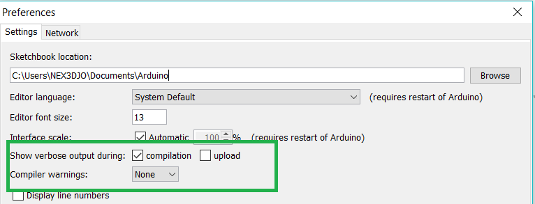
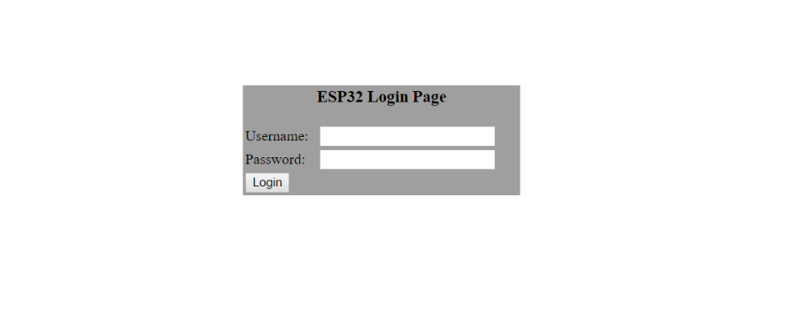
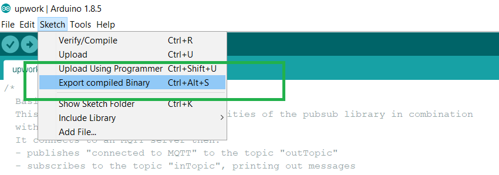

# Over the Air through Web browser
OTAWebUpdate is done with a web browser that can be useful in the following typical scenarios:
- Once the application developed and loading directly from Arduino IDE is inconvenient or not possible
- after deployment if user is unable to expose Firmware for OTA from external update server
- provide updates after deployment to small quantity of modules when setting an update server is not practicable

## Requirements
- The ESP and the computer must be connected to the same network

## Implementation
The sample implementation has been done using:
- example sketch OTAWebUpdater.ino
- NodeMCU 1.0 (ESP-12E Module)
You can use another module also if it meets Flash chip size of the sketch
1-Before you begin, please make sure that you have the following software installed:
 - Arduino IDE
 - Host software depending on O/S you use:
   - Avahi http://avahi.org/ for Linux
   - Bonjour http://www.apple.com/support/bonjour/ for Windows
   - Mac OSX and iOS - support is already built in / no any extra s/w is required

Prepare the sketch and configuration for initial upload with a serial port
- Start Arduino IDE and load sketch OTAWebUpdater.ino available under File > Examples > OTAWebUpdater.ino
- Update ssid and pass in the sketch so the module can join your Wi-Fi network
- Open File > Preferences, look for “Show verbose output during:” and check out “compilation” option

- Upload sketch (Ctrl+U)
- Now open web browser and enter the url, i.e. http://ESP32.local. Once entered, browser should display a form

> username= admin

> password= admin

**Note**-*If entering “http://ESP32.local” does not work, try replacing “ESP32” with module’s IP address.This workaround is useful in case the host software installed does not work*. 

Now click on Login button and browser will display a upload form

For Uploading the New Firmware you need to provide the Binary File of your Code.

Exporting Binary file of the Firmware (Code)
- Open up the Arduino IDE
- Open up the Code, for Exporting up Binary file
- Now go to Sketch > export compiled Binary

- Binary file is exported to the same Directory where your code is present

Once you are comfortable with this procedure go ahead and modify OTAWebUpdater.ino sketch to print some additional messages, compile it, Export new binary file and upload it using web browser to see entered changes on a Serial Monitor

